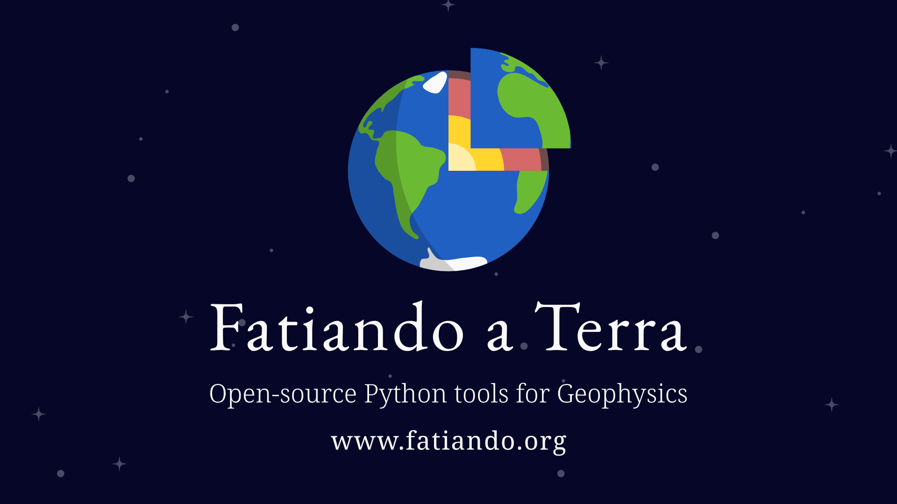

**A day in the life of a Geophysicist often involves engaging in tasks such as
data downloading, processing, modeling, or some type of inversion.
Unfortunately, these tasks are often burdensome or limited to closed-source
software solutions. The Fatiando a Terra projects aims at
overcoming some of these difficulties by offering a completely open-source
Python toolbox tailored for Geoscientists. This week Santiago Soler, a postdoc
at University of British Columbia and one of the main software developers, will
guide us through the world of Fatiando, providing insights into its
capabilities and sharing how you can actively participate and contribute to
this exciting project.**

[Fatiando a Terra][fatiando] is a community-driven project with the goal to
build open-source Python tools for geophysics.

The project started in South America more than ten years ago, as part of the
PhD dissertations of a [group of graduate students][founders] from Rio de
Janeiro, Brazil.
Throughout the years, the project reached higher levels of maturity and gained
[contributors][contributors] and [core developers][developers] from different
regions of the world.

> Fun fact: Fatiando a Terra means "slicing the Earth" in Portuguese.

Nowadays, the project is composed of a set of different Python libraries, each
one with a specific goal and scope. [Verde][verde] offers tools for spatial
data handling and interpolation, with a machine-learning taste.
[Harmonica][harmonica] provides tools for processing and modelling gravity and
magnetic data, while [Boule][boule] hosts reference ellipsoids (e.g. WGS84)
that can perform coordinate conversions and normal gravity calculations.
Lastly, [Pooch][pooch] offers easy to use tools for downloading and caching
data files from the web, and [Ensaio][ensaio] provides curated open-licensed
geophysical datasets useful for research and teaching.

## Choose your own pythonic adventure: what you can do with Fatiando tools?

Fatiando tools can be used in a wide range of geophysical applications.
For example, computing the gravitational fields of large structures can provide
relevant insight to Geodynamic applications, like validating numerical models
against observed gravity data, or inverting Moho depths from satellite gravity
data on continental scales [@uieda2016].
[Harmonica][harmonica] offers tools to calculate the gravitational field of
large scale structures using [_tesseroids_][tesseroids], also known as
spherical prisms, that take into account the curvature of the Earth.
They come handy also in data processing steps, like removing the gravity effect
of topography, also known as _terrain correction_ (Figure 1).

[Harmonica][harmonica] offers classes to interpolate gravity and magnetic data
through the _equivalent sources technique_, a methods that relies on
the non-uniqueness of potential fields. It consists in defining a set of
synthetic sources and adjust their masses so they generate the same
gravitational field as the observed one. Once we define them, we can use them
to _predict_ the same field on any unobserved location.
[Harmonica][harmonica]'s [gradient-boosted equivalent sources][gb-eq] overcome
the computational limitations of classical equivalent sources, allowing to
interpolate very large gravity and magnetic datasets.
For example, they allowed us to generate
a regular grid of almost 2 million (!) gravity observations over Australia on
a desktop computer (Figure 2) [@soler2021].

Moreover, [Harmonica][harmonica] and [Boule][boule] offer all the tools needed
to process gravity data, from observed gravity up to gridded residuals:
removing normal gravity with [Boule][boule]'s ellipsoids (reference ellipsoids
used to define geodetic coordinates, like the WGS84), computing the terrain
correction by forward modelling a model of the topography, removing the
regional field with deep equivalent sources, and producing a gridded product of
this residual field using equivalent sources (Figure 3).

## Our goal: open and reproducible science

Fatiando developers and contributors are committed to build a more [open and
reproducible science][blogpost-open-science] (Figure 4).
All its software is released under open-source licences, making it freely
accessible to any researcher, and helping to make scientific results obtained
by using it more reproducible.

Interested in getting involved? We develop these tools in the open, through
a transparent and auditable process, to which [we invite everyone to join and
participate][contact].
This process has created opportunities for collaborations between researchers
from around the world, beyond the scientific paper: joining efforts to solve
common problems and build tools in a collaborative way.

We also aim to promote best practices for software development among the
scientific community, like creating good documentation, writing tests that
guarantee the software works as expected, and peer-reviewing new additions to
the code.
Following these and other best practices helps to create high quality research
software, and set the environment for other people to easily collaborate
and learn more about software development. If you are a geoscientist interested
in software development and open science don't hesitate to [contact
us][contact]!

## Roadmap for the future

We expect great things for the future of the project.
By the end of July 2023, the Fatiando a Terra and [SimPEG][simpeg] (an
open-source Python project for running geophysical inversions) communities
will join in a [BIRS Workshop][birs] in Banff, Canada, to work on future
roadmaps for the two projects and to join efforts to create further
interactions.

We plan to keep building the project, developing new tools, and improving the
existing ones. Along the way we expect to gain more contributors, enlarge the
community and strengthen the relationships with the rest of the Python
geoscientific ecosystem.

If you like to keep up with our latest updates, check out [our
website][fatiando].

## References

::: {#refs}
:::

## Bio

Santiago Soler is a Physicist and PhD in Geophysics.
He is interested in researching new methods for processing and modelling
gravity and magnetic data, and applying geophysical inversions on timely
environmental problems.
He's committed to contribute to open-source scientific software and to create
a more diverse, open and reproducible science.
He's one of the core developers of [Fatiando a Terra][fatiando] and
[SimPEG][simpeg].
You can find his social media handles in his personal website:
[santisoler.com][santisoler].

[santisoler]: https://www.santisoler.com/about.html
[fatiando]: https://www.fatiando.org
[contact]: https://www.fatiando.org/contact/
[founders]: https://www.fatiando.org/community/#project-founders
[contributors]: https://www.fatiando.org/community/#package-authors
[developers]: https://www.fatiando.org/community/#steering-council
[boule]: https://www.fatiando.org/boule
[harmonica]: https://www.fatiando.org/harmonica
[verde]: https://www.fatiando.org/verde
[pooch]: https://www.fatiando.org/pooch
[ensaio]: https://www.fatiando.org/ensaio
[tesseroid-layer]: https://www.fatiando.org/ensaio
[simpeg]: https://simpeg.xyz
[birs]: https://birs-2023.softwareunderground.org
[gb-eq]: https://www.fatiando.org/harmonica/latest/user_guide/equivalent_sources/gradient-boosted-eqs.html
[tesseroids]: https://www.fatiando.org/harmonica/latest/user_guide/forward_modelling/tesseroid.html#tesseroid
[blogpost-open-science]: https://blogs.egu.eu/divisions/gd/2020/07/24/what-is-fair-for-geodynamics
